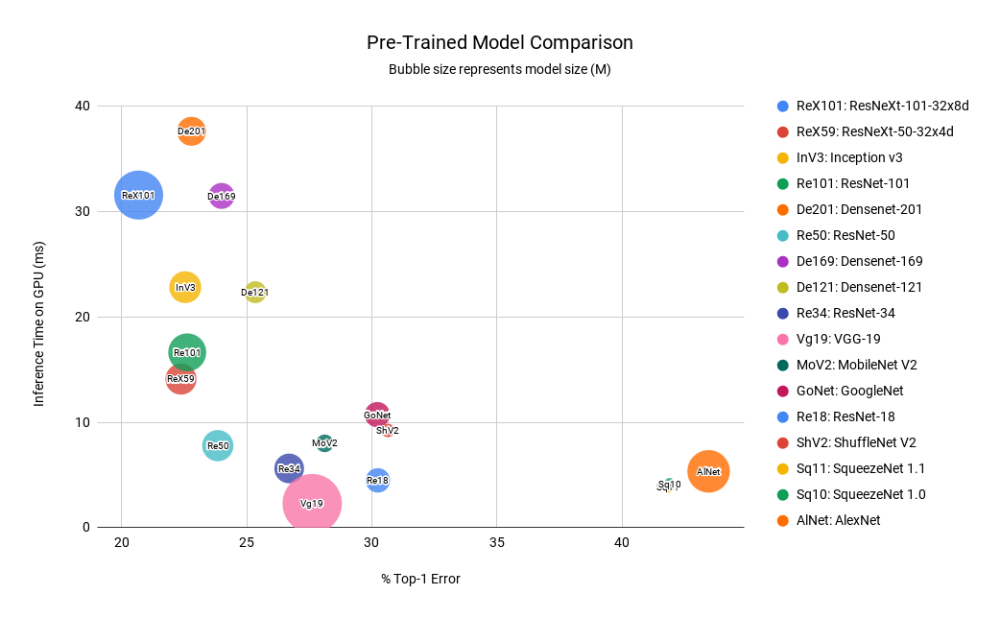

# Image classification
`2020`
Digit Recognizer as My First Entry : Score 0.987/ranking 1035
````
https://www.kaggle.com/c/digit-recognizer/overview
````
Using Pytorch + CNN

# Image Transfer Learning


Dogs vs. Cats
````
https://www.kaggle.com/c/dogs-vs-cats
````
Using Pytorch + transfer learning: VGG16
However, the submission disabled, but still have another kernels enabled.
https://www.kaggle.com/c/dogs-vs-cats-redux-kernels-edition/submit

Malaria Cell Images Dataset
````
https://www.kaggle.com/iarunava/cell-images-for-detecting-malaria
````
Using Pytorch + transfer learning: ResNet50 + tqdm for training progress bar

# NLP
`2021`
Toxic Comment Classification Challenge
```
https://www.kaggle.com/c/jigsaw-toxic-comment-classification-challenge/overview
````
late submission
[LSTM_Toxic Comment Classification Challenge](https://github.com/isabellechiu/Kaggle_Competition/blob/master/lstm-toxic-comment-classification-challenge.ipynb)
public score:0.97652
ranking: 2955

Natural Language Processing with Disaster Tweets
```
https://www.kaggle.com/c/nlp-getting-started/overview
````
First Entry! 💪 🔥
[Natural Language Processing with Disaster Tweets](https://github.com/isabellechiu/Kaggle_Competition/blob/master/NLP/bert-nlp-with-disaster-tweets.ipynb)
public score:0.81949
ranking: 383

